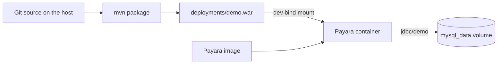

# Docker team workflow

The containers already match a small-team setup. This adds a presenter-style [WORKFLOW.md](WORKFLOW.md) and short comments in the Compose files so a reader can see why each piece is inside the image, in a volume, or on the host. [README.md](README.md) stays the command list. [WALKTHROUGH.md](WALKTHROUGH.md) stays the request path.

## What Docker is for

Payara and MySQL are not installed on the laptop. [docker-compose.yml](docker-compose.yml) is the shared environment: same Payara 7, same Connector/J, same JDBC resource `jdbc/demo`, and the hostname `mysql` only exists on the Compose network. A teammate clones the repo and runs `docker compose up --build`. The multi-stage [payara/Dockerfile](payara/Dockerfile) compiles the WAR inside the image, so that path does not depend on a local Maven install.

Day-to-day edits do not rebuild that image. [compose.dev.yaml](compose.dev.yaml) overlays one file from the host. Host `mvn package` rewrites it; Payara redeploys; the JDBC pool and the debug port stay up.

## Where data is external

Book rows live in the named volume `mysql_data`, mounted at `/var/lib/mysql` in [docker-compose.yml](docker-compose.yml). That directory is outside the container filesystem and outside git. Recreating the Payara or MySQL container keeps the rows. `docker compose down` keeps the volume. `docker compose down -v` deletes it; the next start gets an empty database, JPA `create` builds `books`, and [BookSeeder.java](src/main/java/demo/book/BookSeeder.java) inserts the three sample books again.

Each developer has their own volume. The shared starting data is the seeder in git, not a copied MySQL data directory.

Do not bind-mount `/var/lib/mysql` to a Windows folder. Docker Desktop and MySQL file permissions make that a bad place for database files. The named volume is the external store.

Leave these inside the image, so they stay the same for every machine:

- Payara, in `payara/server-full:7.2026.8`
- MySQL Connector/J, copied in the Dockerfile
- Pool `DemoPool` and resource `jdbc/demo`, in [payara/post-boot-commands.asadmin](payara/post-boot-commands.asadmin)

## Hot reload: one file, not the source tree

Payara autodeploy watches `/opt/payara/deployments` for a changed WAR. It does not compile Java and it does not serve `src/` directly.

The only dev mount, already in [compose.dev.yaml](compose.dev.yaml):

- Host `deployments/demo.war` (gitignored, written by Maven `outputDirectory` in [pom.xml](pom.xml))
- Container `/opt/payara/deployments/demo.war`

Loop: edit Java or `index.xhtml`, run `mvn package`, refresh the browser. The JVM keeps listening on 9009, so the debugger stays attached across that redeploy.

Do not mount `src/main/java` or `src/main/webapp`. An exploded directory plus a `.reload` file is a Payara feature, but autodeploy does not pick up directories, and a tree of class files through Docker Desktop on Windows is a worse loop than replacing one WAR.

## Doc changes

- Add [WORKFLOW.md](WORKFLOW.md) as a short script: clone and `compose up` (image contains the app); add a book; `compose down` and up again (the book is still there); `compose down -v` and up again (the three seed books return); then the dev overlay (`mvn package`, then `compose -f docker-compose.yml -f compose.dev.yaml up`) and a second package to show redeploy without an image rebuild.
- Comment the volume in [docker-compose.yml](docker-compose.yml) and the WAR mount in [compose.dev.yaml](compose.dev.yaml) with the same rule in one or two lines.
- Link [WORKFLOW.md](WORKFLOW.md) from the Layout list in [README.md](README.md).
