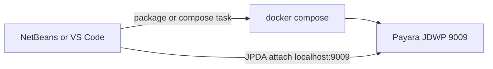

# NetBeans and VS Code integration

The demo already opens as a Maven project and has a minimal attach config in [.vscode/launch.json](.vscode/launch.json). That config does not start the stack, and NetBeans has no project actions. The terminal log (`exec: Dump: not found`) is the earlier `JAVA_TOOL_OPTIONS` startup crash. [docker-compose.yml](docker-compose.yml) now uses `PAYARA_ARGS: "--debug"` instead. IDE attach only works if that process stays up and listens on **9009**.

## Keep the debug port alive

Recreate the stack and confirm Payara logs a successful deploy and port 9009 accepts a connection.

If `--debug` still makes `startInForeground.sh` execute the dry-run header (`Dump`), remove `PAYARA_ARGS` and bake the agent into the domain before the JVM starts, in [payara/Dockerfile](payara/Dockerfile):

`-agentlib:jdwp=transport=dt_socket,server=y,suspend=n,address=*:9009`

inserted as a `<jvm-options>` under the server `java-config` in `domain.xml`. Do not set `JAVA_TOOL_OPTIONS`. That variable is what shifts the dry-run output and makes the script run `exec Dump`.

## NetBeans

No `nbproject` folder. Add [nbactions.xml](nbactions.xml) at the project root so the project context menu gets:

- **Compose Up** — `docker compose up --build`
- **Compose Up Dev** — `docker compose -f docker-compose.yml -f compose.dev.yaml up --build` (bind-mounts `deployments/demo.war` from [compose.dev.yaml](compose.dev.yaml))
- **Package WAR** — `mvn package`, which refreshes that mounted WAR
- **Compose Down** — `docker compose down`

Those Docker actions run through `exec-maven-plugin` in [pom.xml](pom.xml) (`exec.executable` / `exec.args`). Debugger attach stays the built-in NetBeans action: Debug, Attach Debugger, JPDA socket, host `localhost`, port `9009`. Ignore `nbproject/private/` in [.gitignore](.gitignore) if NetBeans creates it.

## VS Code

Extend the existing `.vscode` files (they also work in Cursor):

- [launch.json](.vscode/launch.json): keep **Attach to Payara**, set `projectName` to `library` (the Maven artifact), and run a preLaunch task that waits until `localhost:9009` is open.
- [tasks.json](.vscode/tasks.json): **Package WAR**, **Compose up** as a background task that finishes its problem matcher when the log says the app was deployed, **Compose up dev**, **Compose down**, and **Wait for Payara debug port**.
- Add [.vscode/settings.json](.vscode/settings.json) so the Java extension imports the Maven project (`java.configuration.updateBuildConfiguration`: automatic). The compiler release stays 21 from the POM; the host JDK 25 can compile it.
- [.vscode/extensions.json](.vscode/extensions.json) already recommends the Java pack and Docker.

## Docs

Update the NetBeans and VS Code sections in [README.md](README.md) so they match the new actions: which menu item starts Compose, how a second package redeploys in the dev override, and the attach host/port. Leave the optional Payara Tools remote-server path as optional.
