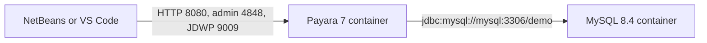

# Payara and MySQL Jakarta EE demo

Empty workspace at [DockerJavaEE](c:\Users\Trainer\Documents\NetBeansProjects\Tmp\DockerJavaEE). Build a small book-catalog web app (Jakarta Faces page plus REST) so the container, datasource, and IDE debug path are all visible.

## Runtime

- [docker-compose.yml](docker-compose.yml): `mysql:8.4` (database `demo`, user `demo` / password `demo`, port 3306) and a Payara service built from [payara/Dockerfile](payara/Dockerfile) (`payara/server-full:7.2026.8`).
- Publish `8080`, `4848`, and `9009`. Payara waits until MySQL is healthy.
- Demo-only credentials: admin user `admin` / password `admin`. Debug via `JAVA_TOOL_OPTIONS` with `address=*:9009` so the host IDE can attach (in-container JDWP must not bind only to localhost).
- [payara/post-boot-commands.asadmin](payara/post-boot-commands.asadmin) creates a JDBC pool (`com.mysql.cj.jdbc.MysqlDataSource`, URL `jdbc:mysql://mysql:3306/demo`) and resource `jdbc/demo`. The image copies MySQL Connector/J into the domain `lib` folder.
- Multi-stage Dockerfile runs `mvn package` and copies the WAR to `$DEPLOY_DIR`, so `docker compose up --build` is enough. A `dev` compose override bind-mounts `deployments/demo.war` for redeploy without rebuilding the image.

## Application

Maven WAR, Java 21, `jakarta.jakartaee-web-api` 11.0.0 `provided`. Context root `/library`.

- JPA entity `Book` (id, title, author), JTA unit in [src/main/resources/META-INF/persistence.xml](src/main/resources/META-INF/persistence.xml) using `jdbc/demo` and schema action `create`.
- CDI service with container-managed `EntityManager`. Startup bean inserts a few books when the table is empty.
- Jakarta REST `GET/POST/DELETE` at `/library/api/books`.
- Jakarta Faces page at `/library/` to list and add books.

## IDE

NetBeans opens the Maven project directly (no generated `nbproject`).

- **Run:** `docker compose up --build`, then open `http://localhost:8080/library/` and admin at `http://localhost:4848`.
- **Debug:** Debug -> Attach Debugger -> host `localhost`, port `9009`. Optional remote server: Services -> Servers -> Add Server -> Payara -> Remote Domain, DAS port `4848`, user `admin`. Hot deploy from NetBeans needs the Payara Tools plugin, a local Payara 7 install of the same version, and the Docker volume mapping documented in the README; the default loop does not require a local server.
- **VS Code:** [.vscode/launch.json](.vscode/launch.json) attaches to `localhost:9009`. [.vscode/tasks.json](.vscode/tasks.json) packages the WAR and starts compose. [.vscode/extensions.json](.vscode/extensions.json) recommends the Java pack and Docker.

[README.md](README.md) covers prerequisites (Docker Desktop, JDK 21, Maven, NetBeans or VS Code), the compose commands, URLs, and both IDE attach steps. [.gitignore](.gitignore) ignores `target/` and `deployments/*.war`.
