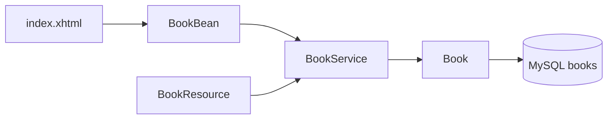

# Project educational walkthrough

The README stays the run guide. A new [WALKTHROUGH.md](WALKTHROUGH.md) teaches the design by following one add-book request, and the source gets short comments that explain Jakarta EE choices the code does not make obvious.

## Walkthrough document

[WALKTHROUGH.md](WALKTHROUGH.md) will walk the files in request order, with a diagram of the two entry points sharing one service:

Sections, each pointing at the real file:

- Faces path: [index.xhtml](src/main/webapp/index.xhtml) binds to `bookBean`, [BookBean.java](src/main/java/demo/web/BookBean.java) is `@Named` and `@RequestScoped`, and `add()` returns `index?faces-redirect=true` so the browser reloads with a GET.
- Shared service: [BookService.java](src/main/java/demo/book/BookService.java) uses a container-managed `EntityManager`. `@Transactional` wraps the writes because `persist` and `remove` need a JTA transaction.
- Mapping: [Book.java](src/main/java/demo/book/Book.java) is the `books` table. [persistence.xml](src/main/resources/META-INF/persistence.xml) names unit `libraryPU`, uses JTA, and points at datasource `jdbc/demo`. Schema action `create` builds the table once and leaves existing rows alone.
- REST path: [LibraryApplication.java](src/main/java/demo/book/LibraryApplication.java) sets `/api`. [BookResource.java](src/main/java/demo/book/BookResource.java) adds `/books`, so the URL is `/library/api/books`. It calls the same `BookService`.
- Startup data: [BookSeeder.java](src/main/java/demo/book/BookSeeder.java) observes the CDI `Startup` event and inserts three books only when the table is empty.
- Container wiring: [web.xml](src/main/webapp/WEB-INF/web.xml) maps `*.xhtml` to `FacesServlet`. [beans.xml](src/main/webapp/WEB-INF/beans.xml) uses `bean-discovery-mode="annotated"`, so only annotated classes become CDI beans. [glassfish-web.xml](src/main/webapp/WEB-INF/glassfish-web.xml) sets the context root `/library`.
- Docker path: [docker-compose.yml](docker-compose.yml) starts MySQL, then Payara. [payara/Dockerfile](payara/Dockerfile) builds the WAR, copies MySQL Connector/J into the domain `lib` folder, and drops the WAR in the deployments directory. [payara/post-boot-commands.asadmin](payara/post-boot-commands.asadmin) creates pool `DemoPool` and resource `jdbc/demo`, which is the same name `persistence.xml` looks up. [pom.xml](pom.xml) marks the Jakarta EE API `provided` because Payara supplies those classes at runtime.

[README.md](README.md) gets one link under Layout so the run steps stay there and the explanation lives in the walkthrough.

## Comments

Class-level and a few method-level comments only, on the concept the annotation is doing. Getters and setters stay uncommented.

- Java: `Book`, `BookService`, `BookResource`, `LibraryApplication`, `BookSeeder`, `BookBean`.
- Config: a short XML comment in `persistence.xml`, `web.xml`, `beans.xml`, and `glassfish-web.xml`; a stage comment in the Dockerfile; a `#` comment in the asadmin file naming the resource the app looks up.
