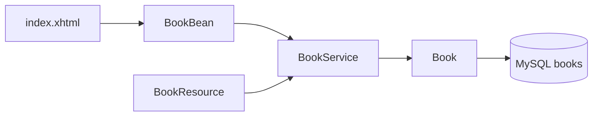

# Walkthrough

This page follows one "add a book" action from the browser to MySQL, then the same action over REST. How to start the containers is in [README.md](README.md).

## Two doors, one service

The page and the REST API both call `BookService`. That class is the only one that talks to the database.



## The Faces page

Open http://localhost:8080/library/. Payara serves this WAR at context root `/library`, set in [glassfish-web.xml](src/main/webapp/WEB-INF/glassfish-web.xml). [web.xml](src/main/webapp/WEB-INF/web.xml) names `index.xhtml` as the welcome file and maps `*.xhtml` to `FacesServlet`, so the server runs the page through Jakarta Faces.

[index.xhtml](src/main/webapp/index.xhtml) is a Facelets page. Expressions in `#{...}` call a CDI bean:

- `#{bookBean.books}` calls `BookBean.getBooks()`, which loads every row.
- The text fields write into `bookBean.title` and `bookBean.author`.
- The button's `action` calls `bookBean.add`.

[BookBean.java](src/main/java/demo/web/BookBean.java) is the bean behind that name. `@Named` publishes the class to Facelets as `bookBean` (the simple class name with a lower-case first letter). `@RequestScoped` creates a new instance for each HTTP request, so one user's form fields stay on that request.

Clicking **Add book** does three things:

1. Faces fills `title` and `author` from the form, then calls `add()`.
2. `add()` delegates to `BookService.add` and clears the fields.
3. The method returns `index?faces-redirect=true`. Faces answers with a redirect, and the browser loads the list again with GET. Refreshing the page does not submit the form a second time.

## The service and the transaction

[BookService.java](src/main/java/demo/book/BookService.java) is `@ApplicationScoped`: CDI keeps one instance for the application. `@PersistenceContext(unitName = "libraryPU")` injects a container-managed `EntityManager`. Payara creates it, joins it to the current transaction, and closes it. Application code does not call `close()`.

`add` and `delete` are marked `@Transactional`. `persist` and `remove` need a JTA transaction. The annotation starts one for the method and commits it when the method returns normally. `findAll` only runs a query, so it has no annotation of its own; it enlists in a transaction when one is already open.

`findAll` uses JPQL (`SELECT b FROM Book b`), which names the entity, not the SQL table.

## The table

[Book.java](src/main/java/demo/book/Book.java) is that entity. `@Entity` and `@Table(name = "books")` map the class to the `books` table. `@Id` with `GenerationType.IDENTITY` lets MySQL assign the primary key on insert. The no-arg constructor is required: the persistence provider calls it when it loads a row, then sets the fields. `Serializable` lets a detached instance travel with a session or a remote call.

[persistence.xml](src/main/resources/META-INF/persistence.xml) names the unit `libraryPU`, the same name `BookService` injects. `transaction-type="JTA"` means Payara begins and commits the transaction. `<jta-data-source>jdbc/demo</jta-data-source>` is a server resource name, not a JDBC URL. The property `jakarta.persistence.schema-generation.database.action` set to `create` builds the table when it is missing and leaves existing rows in place.

## The same save over REST

[LibraryApplication.java](src/main/java/demo/book/LibraryApplication.java) is an empty `Application` subclass with `@ApplicationPath("/api")`. That is enough to turn Jakarta REST on for this WAR: the server scans for `@Path` classes, and `web.xml` does not need a REST servlet mapping.

[BookResource.java](src/main/java/demo/book/BookResource.java) adds `@Path("/books")`. The full URL is the context root, plus the application path, plus the resource path:

`/library` + `/api` + `/books` = http://localhost:8080/library/api/books

`@Inject` supplies the same `BookService` the page uses. `GET` returns the list as JSON. `POST` reads a JSON body into a `Book`, rejects a missing title or author with 400, and on success returns 201 with the saved book (including the generated id). `DELETE /library/api/books/{id}` returns 204, or 404 when that id is absent.

```bash
curl -s -X POST http://localhost:8080/library/api/books \
  -H "Content-Type: application/json" \
  -d "{\"title\":\"A New Book\",\"author\":\"A. Reader\"}"
```

## Sample books at startup

[BookSeeder.java](src/main/java/demo/book/BookSeeder.java) observes the CDI `Startup` event. After the application is up, `onStart` runs. If `books` already has rows, it returns. Otherwise it inserts three titles through `BookService.add`, so the page is not empty the first time you open it. A later redeploy finds those rows and does not insert them again.

[beans.xml](src/main/webapp/WEB-INF/beans.xml) sets `bean-discovery-mode="annotated"`. CDI only manages classes that carry a bean-defining annotation, such as `@ApplicationScoped`, `@RequestScoped`, or `@Path` together with a scope. `Book` has none of those, so it stays an ordinary object that JPA and JAX-RS construct themselves.

## How the server finds MySQL

The application never contains a host name or a password. It looks up `jdbc/demo`, and the server defines what that name means.

1. [docker-compose.yml](docker-compose.yml) starts MySQL as the service `mysql`, with database `demo` and user `demo`. Payara waits until that service is healthy. On the Docker network the host name is `mysql`, which is the Compose service name.
2. [payara/Dockerfile](payara/Dockerfile) is two stages. The first uses Maven to build `demo.war`. The second is the Payara image: it copies MySQL Connector/J into the domain `lib` folder (so the server class loader can load the driver), copies the post-boot commands, and copies the WAR into the deployments directory. Payara deploys that WAR on startup.
3. [payara/post-boot-commands.asadmin](payara/post-boot-commands.asadmin) runs after the domain boots. It creates connection pool `DemoPool` (`serverName=mysql`, database `demo`) and JDBC resource `jdbc/demo`. That resource name is the string in `persistence.xml`.
4. [pom.xml](pom.xml) depends on `jakarta.jakartaee-web-api` with scope `provided`. Maven uses it to compile. The WAR does not bundle it; Payara already has those APIs.

From the form submit to the row, the path is: Facelets, `BookBean`, `BookService` inside a JTA transaction, `EntityManager` through `jdbc/demo`, MySQL. REST joins at `BookResource` and then uses the same service.
