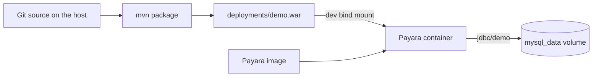

# Workflow

This page is the team loop: one shared Payara image, book rows in a Docker volume, and a single host WAR for redeploy. Commands and IDE menus are in [README.md](README.md). The request path is in [WALKTHROUGH.md](WALKTHROUGH.md).

Payara and MySQL stay off the laptop. [docker-compose.yml](docker-compose.yml) is the environment everyone runs: Payara 7, MySQL Connector/J, JDBC resource `jdbc/demo`, and the hostname `mysql`, which exists only on the Compose network. [payara/Dockerfile](payara/Dockerfile) compiles the WAR inside the image, so `docker compose up --build` does not need Maven on the host.



## Clone and run the image

From a fresh clone:

```bash
docker compose up --build
```

Wait until the log says the application was successfully deployed, then open http://localhost:8080/library/. The three sample books are there. The WAR that served them was copied into the image at build time. A teammate gets that same server, driver, and JDBC pool from the Dockerfile and [payara/post-boot-commands.asadmin](payara/post-boot-commands.asadmin).

These stay inside the image so every machine matches:

- Payara, from `payara/server-full:7.2026.8`
- MySQL Connector/J, copied in the Dockerfile
- Pool `DemoPool` and resource `jdbc/demo`, created by the post-boot commands

## Rows live in the volume

Add a book on the page, for example title `Docker in Action` and author `Jeff Nickoloff`. That row is written through `jdbc/demo` into MySQL.

The files for those rows are the named volume `mysql_data`, mounted at `/var/lib/mysql` in [docker-compose.yml](docker-compose.yml). The volume sits outside the container filesystem and outside git. Each developer has their own. The shared starting data is [BookSeeder.java](src/main/java/demo/book/BookSeeder.java), which inserts the three sample books only when `books` is empty.

In a second terminal:

```bash
docker compose down
docker compose up --build
```

`down` removes the containers and keeps the volume. After Payara deploys again, the page still lists `Docker in Action`. The seeder sees existing rows and returns. JPA schema action `create` builds a missing table and leaves rows that are already there.

Wipe the volume and start clean:

```bash
docker compose down -v
docker compose up --build
```

`-v` deletes `mysql_data`. The next start has an empty database, JPA creates `books`, and the seeder inserts the three sample books again. `Docker in Action` is gone.

MySQL data files stay on that named volume. Binding `/var/lib/mysql` to a folder on Windows runs into Docker Desktop file permissions, so this demo does not do that.

## Redeploy one WAR

Day-to-day edits leave the image alone. Stop the stack (`docker compose down`), package on the host, and start with the dev override:

```bash
mvn -B package
docker compose -f docker-compose.yml -f compose.dev.yaml up --build
```

`mvn package` writes `deployments/demo.war`. [pom.xml](pom.xml) sets that output directory. The file is gitignored. [compose.dev.yaml](compose.dev.yaml) bind-mounts it over the copy inside the image:

- Host `deployments/demo.war`
- Container `/opt/payara/deployments/demo.war`

Payara autodeploy watches that deployments directory for a changed WAR. Run `mvn package` before the first dev Compose command. If `deployments/demo.war` is missing, Docker creates a directory at that path and the mount will not be a WAR.

With the stack still running, change the heading in [index.xhtml](src/main/webapp/index.xhtml) from `Library` to `Team library`, then package again:

```bash
mvn -B package
```

Refresh http://localhost:8080/library/. The new heading is served from the mounted WAR. Compose did not rebuild the image. The JVM keeps listening on port 9009, so a debugger attached there stays attached across that redeploy.

Source stays on the host. Payara does not compile Java and it does not serve `src/main/java` or `src/main/webapp`. The hot-reload unit is the one WAR file Maven just wrote.
